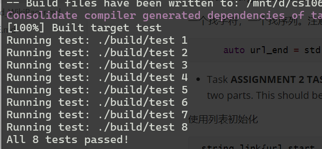
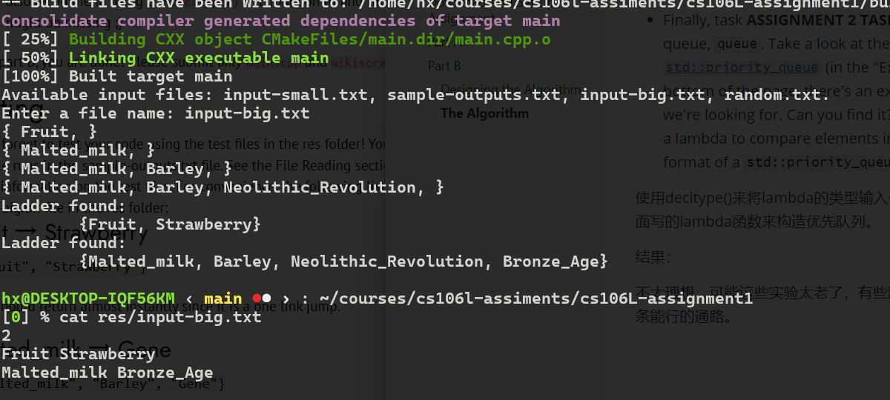

## 	Assignment 1: WikiRacer

### Introduction and Assignment Goals

前面介绍了 [WikiRacer](https://www.thewikigame.com/group)这个游戏。

一个简单的[前端实现](./front_end_WikiRacer.md)。主要实现了 读入文件，询问，并打印出相应的梯子。

在这次任务中，需要实现寻找梯子的搜索算法的核心。

 `findWikiLadders`是这个程序的后端。这个任务要求实现main中的 `findWikiLadders`，和 wikiscraper.cpp 中的`findWikiLinks`

一个宽泛的伪代码 关于 `findWikiLadders`寻找梯子的算法。

```
To find a ladder from startPage to endPage:
    Make startPage the currentPage being processed.
        Get set of links on currentPage.
    If endPage is one of the links on currentPage:
        We are done! Return path of links followed to get here.
    Otherwise:
        Visit each link on currentPage in an intelligent way and
  search each of those pages in a similar manner.
```

简化实现我们分为两部分，在part A，需要实现 `findwikilinks`。这个函数只处理算法中获取currentPage 上的链接集的部分。在Part B,	将通过  `findWikiLinks`  在 `findWikiLadder`实现上面的伪代码。

### Download And Set Up Assignment 

https://web.stanford.edu/class/archive/cs/cs106l/cs106l.1234/assignment-setup

### Part A

实现 `findWikiLinks` 

This function will deal only with the part of our algorithm that gets the set of links on currentPage:

```shell
To find a ladder from startPage to endPage:
    Make startPage the currentPage being processed.
       # Get set of links on currentPage. 
    If endPage is one of the links on currentPage:
                    ...
```

Part A of the assignment will be to implement a function

```c++
unordered_set<string> findWikiLinks(const string& page_html);
```

以某个页面的html的字符串格式作为参数，返回所有的链接集合。

链接满足：

- 格式

  ```html
  <a href="/wiki/PAGE_NAME">LINK TEXT</a>
  ```

- PAGE_NAME does not contain the characters `#` or `:`

查看 findWikiLinks。一个delim ，用来寻找html前缀。 ret ,返回值。inp的迭代器，一个指向头，一个指向尾。

inp是一个页面的字符串。提供了一个无限循环。

- Your first task (labeled **ASSIGNMENT 2 TASK 1** in the code) is to **find the beginning of the next link** (use `std::search` to make your life easier), and if none is found, **break out of the while loop**. This should take around 3 lines of code. *Hint*: use delim!

```c++
		url_start = std::search(url_start,end,delim.begin(),delim.end());
		if(url_start == end) break;
		url_start += delim.size();
```

第三行很重要。因为 ` static const string delim = "href=\"/wiki/";`，而我们只需要wiki后面的部分，看看下面的样例就知道了，或者说delim就是分隔符的意思，当然不能包括。

- Task **ASSIGNMENT 2 TASK 2** is to find the end of the current link, and to put it in a variable called `url_end`. This should be about 1 line. Use `std::find` to make your life easier. *Hint*: All links end with the double quotes character, `"`. Check out the side margin note on the difference between `std::find` and `std::search`.

一个找字符，一个找序列。注意是std::find，不是string的find。

```c++
     auto url_end = std::find(url_start, end ,'\"');
```

- Task **ASSIGNMENT 2 TASK 3** is to construct and store the actual link found between the start and end found in the previous two parts. This should be about 1 line.

使用列表初始化

```c++
 string link{url_start ,url_end};
```

- Finally, task **ASSIGNMENT 2 TASK 4** is to add this link to `ret` *only if it is valid*. That is, only if it does not contain thr characters `#` or `:`. We *highly recommend* implementing and using the decomposed function `valid_wikilink`. Notice, we have implemented the logic for actually adding to the set, all you have to do is implement the `isValidLink` function. This should be about 4 lines, across all functions. You can either use `std::all_of` or a `for` loop to complete this task.

```c++
bool valid_wikilink(const string& link) {
    // replace these lines!
	return std::all_of(link.begin(),link.end(),[](char c){return c != '#' && c != ':';});
}
```

使用lambda，all_of



### Part B

To test your changes, you'll use the command: `./build_and_run.sh`

我们将完成函数：

```c++
vector<string> findWikiLadder(const string& start_page,const string& end_page);
```

一个参数是起始页，另一个是结束页。

返回一个ladder 代表起始页到结束页的链接路径。

之前的伪代码中我们说过，我们将使用一个智能的方式访问网页的链接。下面介绍算法。

#### Designing the Algorithm

*TLDR: As we explore each page, the next link we follow should be the link whose page has the most links in common with the target page.*

我们将搜索每个网页，下一个链接 是 其拥有与目标网页相同链接数量最多的链接。

举了个例子。

start page是 Lion

target page 是 Barack_Obama

Lion 上有这么多链接：

- Middle_Ages
- Federal_government_of_the_United_States
- Carnivore
- Cowardly_Lion
- Subspecies
- Taxonomy_(biology)

很显然我们会选择 Federal_government_of_the_United_States 因为 Barack_Obama 是前总统。

我们的算法想接近通目标页面更接近的链接。如何检测相似度？

One idea to determine “closeness” of a page to the target page is to count the number of links in common between that page and the target page.

直觉告诉我们，相似的页面拥有更多相同的链接。

例如上面的例子中。

| Page                                    | Links in common with Barack_Obama page |
| --------------------------------------- | -------------------------------------- |
| Middle_Ages                             | 0                                      |
| Federal_government_of_the_United_States | 5                                      |
| Carnivore                               | 0                                      |
| Cowardly_Lion                           | 0                                      |
| Subspecies                              | 0                                      |
| Taxonomy_(biology)                      | 0                                      |

Thus, our idea of following **the page with more links in common with the target page** seems like a promising metric. Equipped with this, we can start writing our algorithm.

#### The Algorithm

*TLDR: You will be setting up a priority queue to decide which links to follow as we go!*

优先队列：a data structure where elements can be enqueued (just like a regular queue), but the element with the highest priority (determined by a lambda function that you'll instantiate the queue with) is returned whenever you try to dequeue.

我们可以入队每个可能得页面，然后按照与目标页面相同链接数量来定义优先级。这样每次拥有最高优先级的率先出队。

在我们的代码中，我们将使用vector<string> 来代表梯子。

只用实现注释部分。

```c++
Finding a link ladder between pages start_page and end_page:

// Create an empty priority queue of ladders (a ladder is a vector<string>).

Create/add a ladder containing {start_page} to the queue.

While the queue is not empty:

    Dequeue the highest priority partial-ladder from the front of the queue.


    // Get the set of links of the current page i.e. the page at the end of the
      just dequeued ladder. 

    If the end_page is in this set:
        We have found a ladder!
        Add end_page to the ladder you just dequeued and return it.

    For each neighbour page in the current page’s link set:

        If this neighbour page hasn’t already been visited:

            Create a copy of the current partial-ladder.

            Put the neighbor page string at the end of the copied ladder.

            Add the copied ladder to the queue.


If while loop exits without returning from the function, no ladder was found so return an empty vector<string>
                            
```

Go take a look at the code provided to you in the function `findWikiLadders` in `main.cpp`. We have provided you with an incomplete implementation of the algorithm detailed above. First off, you should see these lines of code:

```c++
vector<string> findWikiLadder(const string& start_page,
const string& end_page) {

  // creates WikiScraper object
  WikiScraper w;

  /* Create alias for container backing priority_queue */
  using container = vector<vector<string>>;

  // gets the set of links on page specified by end_page
  // variable and stores in target_set variable
  auto target_set = w.getLinkSet(end_page);

  // ... rest of implementation
}
```

有几个要点：

container 用于优先队列，container是 vector<vector<string>>的别名。

我们的对列是一队梯子，一个梯子是一个 vector<string>。

通过w.getlinkSet得到某个页面的链接。

不要创建额外的WikiScraper对象，会降低速度。需要完成队列的初始化：

- Task **ASSIGNMENT 2 TASK 5** is to implement the decomposed function `numCommonLinks`, which returns the number of common links on the pages `cur_set` and `target_set`.

```c++
auto ret = std::count_if(curr_set.begin(),curr_set.end(),
			[&target_set](const string &s){return target_set.find(s) != target_set.end();});

	return ret;

```

使用lambda 来判断 目标集合是否包含当前页面集合的某一个链接。

注意count_if 需要加上 algorithm 文件头。

- Task **ASSIGNMENT 2 TASK 6** is to write the comparison function for our priority queue. This function compares two ladders and should return whether ladder1 should have higher priority than ladder2 (in other words, it defines a "less than" function for our ladders). Remember, we want to order the elements by how many links the page at the very end of its respective ladder has in common with the target_page. To make the priority_queue we will need to write this comparator function:

写比较函数，用于优先队列的初始化。还是使用lambda写。

- Finally, task **ASSIGNMENT 2 TASK 7** is to declare the priority queue, `queue`. Take a look at the [documentation for `std::priority_queue`](https://en.cppreference.com/w/cpp/container/priority_queue) (in the "Example" section at the bottom of the page, there's an example of exactly what we're looking for. Can you find it? hint: we're looking to use a lambda to compare elements in our priority queue.) The format of a `std::priority_queue` looks like this:

使用decltype()来将lambda的类型输入优先对列的声明中。使用上面写的lambda函数来构造优先队列。

结果：

不太理想，可能这些实验太老了，有些路径已经行不通了。遂找了条能行的通路。



第一个秒出，后面一个等了四五分钟。

